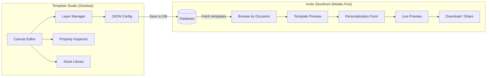
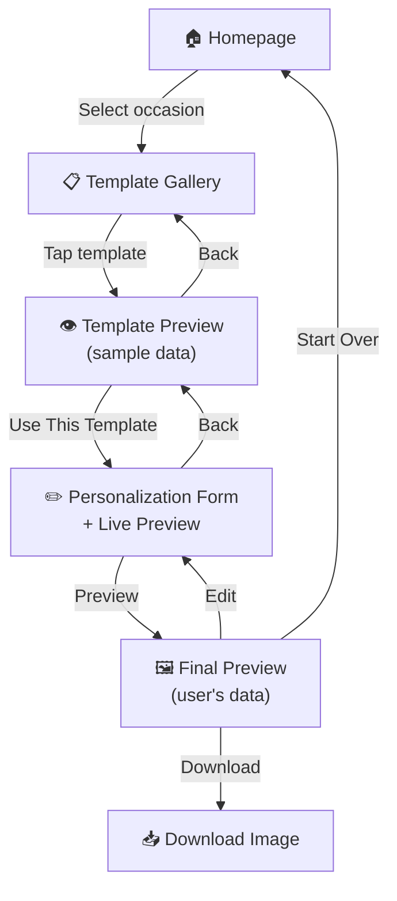
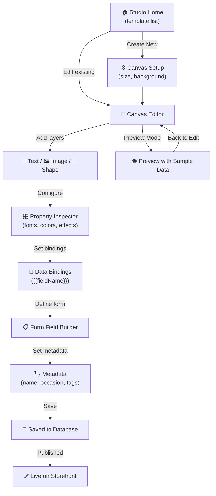

# DesignMyInvites v2 — Product Requirements Document

> **Version**: 2.2  
> **Date**: February 26, 2026  
> **Status**: Active Development (Phase 2 In Progress)  
> **Product Name**: DesignMyInvites  
> **Repository**: `invite-002`

---

## 1. Executive Summary

**DesignMyInvites v2** is a ground-up rebuild of the digital invitation design platform. The product has two distinct halves:

| Surface | Who uses it | Where it runs |
|---------|-------------|---------------|
| **Template Studio** (Admin) | You & your design team | Desktop browsers |
| **Invite Storefront** (Public) | End users creating invitations | Mobile-first (responsive) |

**Template Studio** is a refined, Canva-inspired visual editor where your team designs invitation templates using a layered canvas. Each finished template is serialized to a JSON configuration and stored in the database alongside its metadata (occasion, tags, orientation, thumbnail, etc.).

**Invite Storefront** is a lightweight, mobile-first website where users browse templates by occasion, personalize them with their details through a simple form, see a live preview, and download or share the final invitation — all in under 3 minutes.

### Vision

Be the fastest, most beautiful way to create culturally rich digital invitations — no design skills required. One template, designed once by your team, serves thousands of users effortlessly.

### What's Different from v1

| Area | v1 (invite-001) | v2 (invite-002) |
|------|-----------------|-----------------|
| **Template Studio UX** | Functional but complex; hard to discover features | Streamlined panels, contextual toolbars, keyboard shortcuts, undo/redo |
| **Layer system** | 5 rigid layers (background → content) | Unlimited, freely orderable layers with grouping support |
| **Frontend** | Desktop-oriented SPA | Mobile-first, performance-optimized storefront |
| **Data flow** | Mix of hardcoded configs + Supabase | 100% database-driven from day one |
| **Template schema** | Tightly coupled to occasion types | Flexible, tag-based categorization |
| **Codebase** | Monolithic components (2000+ line files) | Modular, component-driven architecture |

---

## 2. Problem Statement

Creating personalized event invitations is still painful:

1. **Expensive** — Hiring a designer costs ₹2,000–₹10,000+ per invitation
2. **Slow** — Tools like Canva and Photoshop demand design skills and time
3. **Culturally generic** — Most platforms lack Indian cultural & religious motifs (Ganesh, Om, Kalash, rangoli, mandalas, etc.)

**DesignMyInvites** solves this by giving your team a powerful studio to craft culturally authentic templates, and giving end users a dead-simple mobile experience to personalize and download invitations in minutes.

---

## 3. Target Audience

| Segment | Description |
|---------|-------------|
| **Primary users** | Indian families planning weddings, housewarmings (Gruhapravesh), baby showers, engagements, and other ceremonies |
| **Secondary users** | Event planners, small businesses, anyone needing quick digital invitations |
| **Template designers** | You & your team — internal users who create and publish templates via the Template Studio |

---

## 4. Product Architecture

### 4.1 Two-Surface Architecture



### 4.2 Proposed Tech Stack

| Layer | Technology | Status | Purpose |
|-------|-----------|--------|---------|
| **Frontend Framework** | React 19 + Vite 7 | ✅ Confirmed | Fast SPA with HMR |
| **Styling** | TailwindCSS 4 | ✅ Confirmed | Rapid, responsive UI development |
| **State Management** | Zustand | ✅ Confirmed | Lightweight store for canvas/layers/history |
| **Routing** | React Router DOM | ✅ Confirmed | Client-side navigation |
| **Canvas Interaction** | react-moveable | ✅ Confirmed | Drag/resize/rotate with smart snapping |
| **Canvas Rendering** | HTML/CSS layers | ✅ Confirmed | DOM-based layers (not `<canvas>`) |
| **Font Loading** | Google Fonts API (dynamic) | ✅ Confirmed | 20 fonts (incl. Hindi/Devanagari) loaded on-demand |
| **Image Export** | html2canvas | ✅ Confirmed | High-quality PNG/JPEG at 2× resolution |
| **Database & Auth** | Supabase (PostgreSQL) | 🔲 Planned | Template storage, user data, authentication |
| **Asset Storage** | Supabase Storage or Cloudinary | 🔲 Planned | Image CDN + optimization |
| **Deployment** | Vercel | 🔲 Planned | Hosting + edge CDN |

> [!NOTE]
> Tech stack decisions marked ✅ are confirmed and implemented. Remaining items will be finalized in later phases.

---

## 5. Feature Requirements — Template Studio (Admin)

The Template Studio is a desktop-focused visual editor used by your team to design templates.

### 5.1 Canvas & Workspace

#### TS-01: Canvas Setup
- **Priority**: P0
- Create new template with selectable canvas presets or custom dimensions
- Presets: A4 Portrait/Landscape, A5 Portrait/Landscape, Square (1:1), Instagram Post (1080×1080), Instagram Story (1080×1920), WhatsApp Status (1080×1920), Custom
- Canvas background: solid color, gradient (linear), or uploaded image
- **Background gradient presets**: 24 curated quick-pick gradients (warm, cool, pastel, jewel, dark, neutral, festive) + custom start/end color pickers + angle slider
- **Background solid presets**: 12 quick-pick colors + custom hex color picker
- Zoom controls: fit-to-screen, zoom in/out, percentage selector
- Rulers and optional grid/snap-to-grid for precise alignment

#### TS-01b: Canva-Style Sidebar ✅
- **Priority**: P0
- 64px dark-themed icon rail on the far left with expandable 280px content panels
- Panels: **Templates**, **Layers**, **Elements**, **Text**, **Uploads**, **Background**
- Click an icon to open its panel; click again to collapse
- Replaces the legacy single LayerPanel with a modern, organized tool sidebar

#### TS-02: Infinite Undo/Redo
- **Priority**: P0
- Full undo/redo history stack for all canvas operations
- Keyboard shortcuts: `Ctrl+Z` / `Ctrl+Shift+Z`
- History should survive panel switches (e.g., switching between layer properties)

### 5.2 Layer System

#### TS-03: Unlimited Layers
- **Priority**: P0
- Add unlimited layers of different types: **Text**, **Image**, **Shape**, **Decorative/Symbol**
- Each layer has: position (x, y), dimensions (w, h), rotation, opacity, z-index, visibility toggle, lock toggle
- Layers panel (left sidebar) shows layer stack with:
  - Drag-to-reorder
  - Rename (double-click)
  - Visibility eye icon
  - Lock/unlock icon
  - Delete (with confirmation or undo)
  - Duplicate layer

#### TS-04: Layer Grouping
- **Priority**: P1
- Select multiple layers and group them
- Groups behave as a single unit for move/resize/rotate
- Groups can be nested (groups within groups)
- Ungroup to restore individual layer control

#### TS-05: Multi-Select & Alignment
- **Priority**: P1
- `Shift+Click` or marquee selection to select multiple layers
- Alignment tools for selected layers: Align left/center/right, top/middle/bottom
- Distribute evenly (horizontal/vertical)
- Smart guides / snap lines when dragging elements

### 5.3 Text Layers

#### TS-06: Rich Text Editing
- **Priority**: P0
- Click on text to edit inline directly on canvas
- Font family picker (Google Fonts integration — Playfair Display, Great Vibes, Lora, Poppins, Noto Sans Devanagari, etc.)
- Font size, weight (bold), style (italic), decoration (underline)
- Text color with color picker (hex, RGB, presets)
- Text alignment: left, center, right, justify
- Letter spacing and line height controls
- Multi-line text support with auto-wrapping or manual line breaks
- **Text resize behavior** (Canva-like):
  - Bounding box auto-sizes height to fit text content (`height: auto`)
  - Resizing via handles scales font size proportionally (min 8px)
  - Width constrains text wrapping; height adjusts automatically

#### TS-07: Data Bindings for Dynamic Text
- **Priority**: P0
- Any text layer can contain **binding placeholders**: `{{fieldName}}`
- Bindings link to form fields (defined in TS-12)
- In preview mode, bindings are replaced with sample data
- In user-facing storefront, bindings are replaced with user input
- Visual indicator (subtle highlight or tag) on bound text so designers can see which fields are dynamic

#### TS-08: Text Effects
- **Priority**: P1
- Effects applicable per text layer:
  - **Drop Shadow**: color, offset (x/y), blur radius
  - **Text Outline/Stroke**: color, width
  - **Glow/Neon**: color, intensity, blur
  - **Gradient Fill**: linear gradient across text
  - **Opacity**: 0–100%
- Effects panel accessible from the property inspector when a text layer is selected
- Multiple effects stackable on a single layer

### 5.4 Image & Asset Layers

#### TS-09: Image Upload & Placement ✅
- **Priority**: P0
- Upload images (PNG, JPG, SVG, WebP) directly into the canvas as image layers
- **Uploads panel** with persistent gallery — uploaded images saved to localStorage for reuse across sessions
- Multi-file upload support, 2-column thumbnail grid with hover overlay, delete button
- Click any gallery thumbnail to re-add it as a new image layer
- Drag to position, resize handles to scale
- Image layers support: opacity, border radius, rotation, fit mode (cover/contain/fill)
- **Image filters & effects** (stored in `image.filters`):
  - **Color Tint**: Color picker + intensity slider + enable/disable toggle (applies as `mix-blend-mode: multiply` overlay)
  - **Drop Shadow**: X/Y offset, blur radius, shadow color (CSS `drop-shadow` filter)
  - **Flip**: Horizontal and vertical flip buttons
  - **Brightness**: 0–200% slider
  - **Contrast**: 0–200% slider
  - **Blur**: 0–20px slider
  - **Reset All Effects**: One-click reset button
- Support both uploaded images (base64 data URIs) and URL-based images

#### TS-10: Asset Library ✅
- **Priority**: P1
- Built-in library panel (Elements tab in sidebar) of reusable SVG assets organized by category:
  - **Borders & Frames**: Decorative border SVGs in various styles
  - **Cultural Symbols**: Ganesh, Om, Kalash, Swastik, Diya, Rangoli, Shree, etc.
  - **Decorative Elements**: Floral motifs, hearts, stars, mandalas, dividers, corners
- Click to add asset as a new image layer on canvas (SVG → data URI)
- All image filters (tint, shadow, flip, brightness, contrast, blur) apply to SVG elements too
- Search/filter within library
- Admin can upload new assets to the library over time

#### TS-10b: Templates Panel ✅
- **Priority**: P0
- Sidebar panel for browsing, searching, and loading saved templates
- Search by template name, tags, or occasion
- Occasion filter pills (All, Wedding, Birthday, Engagement, Baby Shower, etc.)
- 2-column template grid with **real captured thumbnails** (html2canvas snapshot)
- Click a template to load it into the current editor (with confirmation)
- Thumbnails auto-generated on save as compressed JPEG data URLs

### 5.5 Shape Layers

#### TS-11: Basic Shapes
- **Priority**: P2
- Add shapes: Rectangle, Circle/Ellipse, Line, Divider
- Shape properties: fill color, border color, border width, border radius, opacity
- Useful for design accents, containers, and section dividers

### 5.6 Form Field Builder

#### TS-12: Define User-Facing Form Fields
- **Priority**: P0
- Per template, define the list of form fields that end users will fill out
- Each field has: `id`, `label`, `type`, `placeholder`, `required` (boolean), `defaultValue`, `order`
- Supported field types: `text`, `textarea`, `date`, `time`, `select` (with options), `number`, `tel`, `url`, `file` (image upload)
- Visual form field builder UI — add, remove, reorder fields with drag-and-drop
- Field `id` must match the binding placeholder in text layers (e.g., field `groomName` → `{{groomName}}` in text)
- Preview panel: see how the form will look to end users

### 5.7 Template Metadata & Save

#### TS-13: Template Metadata
- **Priority**: P0
- Before saving, template must have:
  - **Name**: Display name of the template
  - **Occasion/Category**: Select from existing categories or create a new one (e.g., Wedding, Housewarming, Baby Shower, Birthday, Engagement, Anniversary, etc.)
  - **Tags**: Free-form tags for filtering (e.g., "floral", "traditional", "modern", "gold", "marathi")
  - **Language**: Primary language (English, Hindi, Marathi, or Multilingual)
  - **Status**: Draft / Published / Archived
  - **Thumbnail**: Auto-generated from the canvas, or manually uploaded
- Optional metadata: description, designer name, version notes

#### TS-14: Save & Load
- **Priority**: P0
- Save the complete template (canvas config + layers + form fields + metadata) as a single JSON document to the database
- Auto-save with debounce (save after 5 seconds of inactivity)
- Manual save button with "Saved" confirmation
- Load existing templates from a template list view
- Duplicate template (deep copy for creating variations)
- Delete template (soft delete — mark as archived)

#### TS-15: Template Preview Mode
- **Priority**: P0
- Toggle between **Edit Mode** and **Preview Mode** within the Studio
- Preview mode fills all `{{bindings}}` with sample data (from `previewData` config)
- Preview shows the template exactly as end users will see it
- Quick preview at different device sizes (desktop, tablet, mobile)

### 5.8 Keyboard Shortcuts & UX Polish

#### TS-16: Keyboard Shortcuts
- **Priority**: P1
- Core shortcuts:
  - `Ctrl+Z` / `Ctrl+Shift+Z`: Undo / Redo
  - `Ctrl+S`: Save
  - `Ctrl+D`: Duplicate selected layer
  - `Delete` / `Backspace`: Delete selected layer
  - `Ctrl+G`: Group selected layers
  - `Ctrl+Shift+G`: Ungroup
  - Arrow keys: Nudge selected layer by 1px (+ Shift = 10px)
  - `Ctrl+A`: Select all layers
  - `Ctrl+C` / `Ctrl+V`: Copy / Paste layers
- Shortcuts reference panel accessible via `?` key

#### TS-17: Context Menus
- **Priority**: P2
- Right-click on canvas / layer to access contextual actions (duplicate, delete, bring to front, send to back, lock, group, etc.)

---

## 6. Feature Requirements — Invite Storefront (Public, Mobile-First)

The Storefront is the user-facing website optimized for mobile devices.

### 6.1 Browsing & Discovery

#### SF-01: Homepage
- **Priority**: P0
- Clean, visually striking landing page showcasing the platform
- Occasion cards/tiles (Wedding, Housewarming, Baby Shower, etc.) with beautiful icons/illustrations
- "Browse All Templates" or "Trending Templates" section
- Optional: search bar for template name or tag search
- Mobile: full-width stacked occasion cards with large tap targets

#### SF-02: Template Gallery
- **Priority**: P0
- Grid of template thumbnail cards for the selected occasion
- Each card shows: thumbnail image, template name, and optional tags
- Filter/sort options: by popularity, newest, language, tags
- Infinite scroll or paginated loading
- Mobile: 2-column responsive grid, optimized image loading (lazy load, blur-up placeholders)

#### SF-03: Template Preview
- **Priority**: P0
- Full-size preview of the template with sample data filled in
- Action buttons: "Use This Template" (→ personalization form), "Back to Gallery"
- Mobile: full-screen preview with sticky bottom action bar

### 6.2 Personalization & Download

#### SF-04: Personalization Form
- **Priority**: P0
- Dynamic form generated from the template's `formFields` configuration
- Split layout on desktop: left = form, right = live preview
- Stacked layout on mobile: form on top, collapsible live preview below (or toggle between form / preview)
- Form fields render based on type (text input, date picker, time picker, dropdown, file upload, etc.)
- Required fields clearly marked
- Form validation with inline error messages
- Real-time preview: as user types, the invitation preview updates live

#### SF-05: Final Preview
- **Priority**: P0
- Full-screen render of the invitation with the user's actual data
- Action bar: "Download", "Edit" (go back to form), "Share" (future), "Start Over"
- Mobile: pinch-to-zoom on final preview

#### SF-06: Download
- **Priority**: P0
- Download the finalized invitation as a high-quality PNG or JPEG image
- Image resolution should match the original canvas dimensions (or a high-DPI multiplier for print quality)
- Download button triggers a client-side render → file download (no server round-trip)

#### SF-07: Share (Future)
- **Priority**: P2
- Generate a shareable link to view the invitation online
- Direct share to WhatsApp (deep link with image attachment)
- Social media sharing (Instagram, Facebook)
- QR code for printed invitations linking to the digital version

### 6.3 User Accounts (Future)

#### SF-08: User Authentication
- **Priority**: P2
- Sign up / log in via email or Google (Supabase Auth)
- Save past invitations to user profile
- Re-edit or re-download previously created invitations

---

## 7. Data Architecture

### 7.1 Template JSON Schema

Each template is stored as a JSON document in the database. This is the single source of truth that powers both the Studio editor and the Storefront renderer.

```jsonc
{
  "id": "uuid",
  "name": "Royal Wedding Invitation",
  "occasion": "wedding",
  "tags": ["traditional", "gold", "floral", "hindi"],
  "language": "hindi",
  "status": "published",      // draft | published | archived
  "thumbnailUrl": "https://...",

  "canvas": {
    "width": 1080,
    "height": 1920,
    "preset": "instagram-story",  // or "custom"
    "background": {
      "type": "image",            // solid | gradient | image
      "color": "#FFF8DC",         // for type: solid
      "gradient": { "type": "linear", "angle": 135, "stops": [...] },
      "imageUrl": "https://..."   // for type: image
    }
  },

  "layers": [
    {
      "id": "layer-uuid",
      "type": "text",             // text | image | shape | symbol
      "name": "Groom Name",       // display name in layer panel
      "visible": true,
      "locked": false,
      "position": { "x": 540, "y": 600 },
      "dimensions": { "width": 400, "height": 60 },
      "rotation": 0,
      "opacity": 1,

      // --- Text-specific properties ---
      "text": {
        "content": "{{groomName}}",
        "binding": "groomName",        // links to formFields
        "fontFamily": "Great Vibes",
        "fontSize": 48,
        "fontWeight": "normal",
        "fontStyle": "normal",
        "color": "#8B7355",
        "textAlign": "center",
        "letterSpacing": 0,
        "lineHeight": 1.4,
        "effects": [
          { "type": "shadow", "color": "#000", "offsetX": 2, "offsetY": 2, "blur": 4 }
        ]
      },

      // --- Image-specific properties ---
      "image": {
        "src": "https://...",
        "objectFit": "cover",
        "borderRadius": 0,
        "filters": {
          "tintEnabled": false,
          "tintColor": "#000000",
          "tintIntensity": 1,
          "shadowEnabled": false,
          "shadowX": 4, "shadowY": 4, "shadowBlur": 8, "shadowColor": "#000000",
          "flipH": false, "flipV": false,
          "brightness": 100,  // 0-200%
          "contrast": 100,    // 0-200%
          "blur": 0           // 0-20px
        }
      },

      // --- Shape-specific properties ---
      "shape": {
        "shapeType": "rectangle",
        "fill": "#D4AF37",
        "stroke": "#000",
        "strokeWidth": 1,
        "borderRadius": 8
      }
    }
    // ... more layers
  ],

  "formFields": [
    {
      "id": "groomName",
      "label": "Groom's Name",
      "type": "text",
      "placeholder": "Enter groom's name",
      "required": true,
      "defaultValue": "",
      "order": 1
    },
    {
      "id": "eventDate",
      "label": "Event Date",
      "type": "date",
      "required": true,
      "order": 3
    }
    // ... more fields
  ],

  "previewData": {
    "groomName": "Raj Patel",
    "brideName": "Priya Sharma",
    "eventDate": "2026-12-15",
    "venue": "Grand Ballroom, Mumbai"
  },

  "metadata": {
    "createdAt": "2026-02-25T00:00:00Z",
    "updatedAt": "2026-02-25T00:00:00Z",
    "createdBy": "admin",
    "version": 1
  }
}
```

### 7.2 Database Tables (Supabase)

| Table | Purpose | Key Fields |
|-------|---------|------------|
| **templates** | Template JSON configs | `id`, `name`, `occasion`, `tags[]`, `language`, `status`, `canvas` (jsonb), `layers` (jsonb), `form_fields` (jsonb), `preview_data` (jsonb), `thumbnail_url`, `is_premium`, `created_at`, `updated_at` |
| **occasions** | Occasion/category definitions | `id`, `name`, `slug`, `icon_url`, `description`, `sort_order`, `is_active` |
| **assets** | Reusable design assets (borders, symbols, etc.) | `id`, `name`, `category`, `tags[]`, `thumbnail_url`, `full_url`, `file_type`, `created_at` |
| **user_invitations** | Saved user work (future) | `id`, `user_id`, `template_id`, `form_data` (jsonb), `status`, `created_at` |
| **users** | User accounts (future) | Managed by Supabase Auth |

### 7.3 Canvas Size Presets

| Preset | Width × Height | Use Case |
|--------|---------------|----------|
| A4 Portrait | 2480 × 3508 px | Print-ready invitations |
| A4 Landscape | 3508 × 2480 px | Print-ready landscape |
| A5 Portrait | 1748 × 2480 px | Compact print invitations |
| A5 Landscape | 2480 × 1748 px | Compact print landscape |
| Square | 1080 × 1080 px | Instagram post, general social |
| Instagram Story | 1080 × 1920 px | Stories, WhatsApp status |
| WhatsApp Share | 800 × 1200 px | Optimized for WhatsApp image sharing |
| HD Landscape | 1920 × 1080 px | Desktop wallpaper, email header |
| Custom | User-defined | Any arbitrary width/height |

> [!NOTE]
> Dimensions above are for the **design canvas** (export resolution). The Studio editor will display a scaled-down version to fit the workspace.

---

## 8. User Flows

### 8.1 End-User Flow (Storefront)



**Target: Homepage to download in under 3 minutes.**

### 8.2 Admin/Designer Flow (Template Studio)



---

## 9. URL Structure

### 9.1 Storefront Routes (Public)

| Route | Page |
|-------|------|
| `/` | Homepage — occasion selection |
| `/templates/:occasion` | Template gallery for occasion |
| `/template/:id/preview` | Template preview with sample data |
| `/template/:id/create` | Personalization form + live preview |
| `/template/:id/final` | Final preview with user data |

### 9.2 Studio Routes (Admin)

| Route | Page |
|-------|------|
| `/studio` | Studio home — template list & management |
| `/studio/new` | New template — canvas setup + editor |
| `/studio/edit/:id` | Edit existing template |
| `/studio/assets` | Asset library management |
| `/studio/occasions` | Occasion/category management |

---

## 10. Non-Functional Requirements

### 10.1 Performance

| Metric | Target |
|--------|--------|
| Storefront initial load (mobile, 4G) | < 2 seconds |
| Template gallery rendering | < 1 second (lazy-loaded thumbnails) |
| Live preview latency | < 50ms per keystroke |
| Image download generation | < 3 seconds |
| Studio editor responsiveness | 60fps for drag/resize operations |

### 10.2 Mobile Experience (Storefront)

- Touch-optimized: large tap targets (min 44px), swipe gestures
- Responsive breakpoints: mobile (< 640px), tablet (640–1024px), desktop (> 1024px)
- Image optimization: responsive images with srcset, WebP/AVIF with fallbacks
- Offline-ready: service worker for caching static assets (future)

### 10.3 Browser Support

| Surface | Browsers |
|---------|----------|
| **Storefront** | Chrome 90+, Safari 15+ (iOS), Firefox 90+, Samsung Internet, Edge 90+ |
| **Studio** | Chrome 90+, Firefox 90+, Edge 90+ (desktop only) |

### 10.4 Security

- Supabase Row Level Security (RLS) for data isolation
- Admin/Studio routes protected by authentication
- File uploads validated: file type whitelist, max size 10MB
- No server-side rendering of user content (XSS prevention)
- Rate limiting on API endpoints (future)

---

## 11. Phased Roadmap

### Phase 1: Foundation — Template Studio Core ✅
- [x] Project setup (React 19 + Vite 7 + TailwindCSS 4)
- [x] Studio canvas editor: create canvas, set background
- [x] Layer system: add/remove/reorder text, image & shape layers
- [x] Layer properties: position, size, rotation, opacity
- [x] Text editing: font picker, size, color, alignment, letter spacing, line height
- [x] Data bindings: `{{fieldName}}` placeholders in text
- [x] Form field builder: define fields per template
- [x] Save/load templates to localStorage (Supabase migration planned)
- [x] Undo/redo history (50-state cap)
- [x] On-canvas interaction via react-moveable (drag/resize/rotate with smart snapping)
- [x] Shape layer properties (type, fill, stroke, border radius)
- [x] Google Fonts dynamic loading (20 fonts incl. Hindi/Devanagari)
- [x] Export to PNG (html2canvas at 2× resolution)
- [x] Keyboard shortcuts (Ctrl+Z/Y, Ctrl+S, Delete, Ctrl+D, arrows)

### Phase 2: Studio Polish & Assets (In Progress)
- [x] Canva-style sidebar shell (64px icon rail + 280px expandable panels)
- [x] Templates panel — browse, search, filter, and load saved templates
- [x] Asset library panel (borders, symbols, decoratives as SVG elements)
- [x] Text quick-add presets (heading, subheading, body, caption)
- [x] Uploads panel with persistent image gallery (localStorage-backed)
- [x] Background panel with 24 gradient presets + custom controls
- [x] Image/element filters: color tint, drop shadow, flip, brightness, contrast, blur
- [x] Auto-generated template thumbnails on save (html2canvas → JPEG)
- [x] Real-time rotation sync between canvas drag handles and property panel
- [x] Template metadata panel (occasion, tags, status, language)
- [x] Template preview mode (with sample data)
- [x] Template duplicate & archive
- [x] CSS polish & visual refinements
- [ ] Text effects (shadow, outline, glow, gradient fill)
- [ ] Layer grouping & multi-select
- [ ] Alignment & distribution tools
- [ ] Supabase migration (replace localStorage)

### Phase 3: Storefront MVP
- [ ] Homepage with occasion selection
- [ ] Template gallery with filtering
- [ ] Template preview page (sample data)
- [ ] Personalization form (dynamic from `formFields`)
- [ ] Live preview (real-time binding updates)
- [ ] Final preview page
- [ ] Download as image (PNG/JPEG)
- [ ] Mobile-first responsive design
- [ ] SEO basics (meta tags, semantic HTML, Open Graph)

### Phase 4: Cloud & Performance
- [ ] Asset storage migration to Supabase Storage / Cloudinary
- [ ] Image optimization pipeline (thumbnails, WebP, lazy loading)
- [x] Auto-generate template thumbnails on save *(moved from Phase 4, completed in Phase 2)*
- [ ] CDN caching & edge delivery
- [ ] Performance auditing (Lighthouse > 90 on mobile)

### Phase 5: Growth Features
- [ ] User authentication (Supabase Auth)
- [ ] Save/retrieve user invitations
- [ ] Share via link / WhatsApp
- [ ] Premium templates & payment (Razorpay)
- [ ] User photo upload layer in templates
- [ ] QR code generation
- [ ] Multi-language UI (English, Hindi, Marathi)

---

## 12. Key Design Decisions

| Decision | Choice | Rationale |
|----------|--------|-----------|
| **Two separate surfaces** | Studio (desktop) + Storefront (mobile-first) | Different UX needs — builders need precision, users need simplicity |
| **Unlimited layers vs. fixed 5** | Unlimited, freely ordered | More creative freedom; no artificial constraints on template design |
| **Data-binding approach** | `{{fieldName}}` mustache-style | Simple, readable, easy to implement and preview |
| **100% DB-driven from day 1** | No hardcoded template configs | Avoid the v1 scaling problem (1900+ line config file) |
| **Form fields per template** | Not per occasion | Maximum flexibility — same occasion can have minimal and detailed templates |
| **HTML/CSS rendering** | Not `<canvas>` element | Easier to manipulate, style, and bind dynamic text; export via html-to-image |
| **Zustand for state** | Zustand (confirmed) | Single store with history, clean API, minimal boilerplate |
| **Studio is desktop-only** | Not responsive | Internal tool; investing mobile effort in the Storefront instead |

---

## 13. Success Metrics

| Metric | Target |
|--------|--------|
| Template creation time (Studio) | < 15 minutes per template |
| Invitation creation time (Storefront) | < 3 minutes from homepage to download |
| Template library size (MVP launch) | 30+ published templates across 5+ occasions |
| Storefront mobile Lighthouse score | > 90 (Performance + Accessibility) |
| Successful downloads | > 80% of users who start personalization complete a download |

---

## 14. Risks & Mitigations

| Risk | Impact | Mitigation |
|------|--------|------------|
| Studio editor complexity → long dev time | High | Phase the build; get core layers working first, add polish later |
| html-to-image export quality issues | Medium | Test across browsers early; maintain a fallback rendering path |
| Template JSON schema changes breaking existing templates | High | Version the schema; write migrations for schema updates |
| Mobile storefront performance with complex templates | Medium | Limit layer count for rendering; use pre-rendered thumbnail for gallery |
| Asset library growing unmanageably | Low | Category + tag system with search; archiving for unused assets |

---

## 15. Glossary

| Term | Definition |
|------|------------|
| **Template Studio** | The admin-facing visual editor where templates are designed |
| **Invite Storefront** | The public-facing, mobile-first website for end users |
| **Layer** | A single visual element on the canvas (text, image, shape, or symbol) |
| **Binding** | A `{{fieldName}}` placeholder in a text layer that gets replaced with user input |
| **Form Field** | A user-facing input defined per template (name, date, venue, etc.) |
| **Occasion** | A category of event (wedding, housewarming, baby shower, etc.) |
| **Canvas Preset** | Predefined canvas dimensions for common use cases |
| **Asset** | A reusable design element (border, symbol, decoration) from the library |
| **Preview Data** | Sample values used to preview a template before user personalization |

---

*This PRD is a living document. It will be updated as the product evolves through each phase.*
